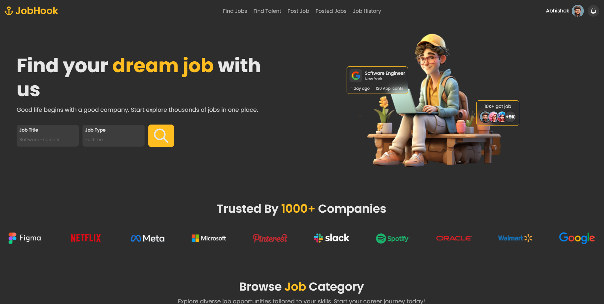

# 🧑‍💻 Job Portal

## 📋 Description

**Job Portal** is a full-stack web application designed to help job seekers find suitable job listings and employers hire the right talent. With user-friendly interfaces for both job seekers and employers, the platform allows job seekers to register, create a profile, and apply for job listings. Employers can post jobs, view applications, and manage their listings. 

The project is built using **React** for the frontend and **Spring Boot** for the backend. It incorporates JWT authentication, real-time notifications, and an advanced search for job listings.

### 🌐 Project Links:
- [Frontend Repository](https://github.com/Arrk01/JobPortal2/tree/main/frontend)
- [Backend Repository](https://github.com/Arrk01/JobPortal2/tree/main/backend)
- [Website Link](https://jobportal-frontend-sog4.onrender.com/)

## ✨ Features

- **🔒 User Authentication**: Secure login and signup via JWT with social login options (Google/Facebook).
- **👤 User Profiles**: Job seekers can create and manage their personal profiles, upload resumes, and track their applications.
- **📢 Job Listings**: Employers can post job openings, and job seekers can browse and apply to available positions.
- **📄 Resume Upload**: Job seekers can upload resumes and cover letters for job applications.
- **👨‍💼 Employer Dashboard**: Employers can view job applicants, manage job postings, and track the hiring process.
- **🔔 Real-time Notifications**: Notifications for job applications, job alerts, and updates.
- **🔍 Advanced Job Search**: Filters to search job listings by title, location, company, salary, etc.
- **💬 Messaging**: Direct messaging between job seekers and employers.

## 📚 Usage

### Job Seekers
- **Register**: Create a new account via email or social login (Google/Facebook).
- **Login**: Sign in to access the platform.
- **Create a Profile**: Add details such as your experience, skills, and upload a resume.
- **Browse Jobs**: Search for job listings using filters such as location, salary, and company.
- **Apply for Jobs**: Apply directly for jobs through your profile.

### Employers
- **Sign Up**: Create an employer account.
- **Post Jobs**: Add job listings with details about the job, company, and qualifications.
- **Manage Listings**: Edit and delete job postings.
- **Review Applicants**: View profiles and resumes of job seekers who have applied.

### Notifications
- **Job Alerts**: Job seekers get notified when new jobs matching their criteria are posted.
- **Application Updates**: Get notifications on the status of your job applications.

## 🤝 Contributing

We welcome contributions! Here's how you can help:

1. Fork the repository and clone it to your local machine.
2. Create a new branch for your changes:
   ```bash
   git checkout -b feature/your-feature
   ```
3. Make your changes, ensuring to write tests for new features or bug fixes.
4. Push your changes to your forked repository:
   ```bash
   git push origin feature/your-feature
   ```
5. Open a pull request to the `main` branch of this repository.

### Code of Conduct
Please follow the [Code of Conduct](CODE_OF_CONDUCT.md) while contributing.

## 📝 License

This project is licensed under the MIT License - see the [LICENSE](LICENSE) file for details.

## 🛠️ Technologies Used

- **Frontend**:
  - 🔧 React.js
  - 🎨 Tailwind CSS (for styling)
  - 📦 Redux (for state management)
  - 🌐 Axios (for making API requests)
  - 🛠️ React Router (for routing)
  
- **Backend**:
  - 🖥️ Spring Boot
  - 🛡️ Spring Security (for authentication and authorization)
  - 🔑 JWT (JSON Web Tokens for authentication)
  - 🗃️ MongoDB (database management)
  
- **Other Tools**:
  - ⚙️ Maven (for dependency management and build)
  - 🛠️ GitHub Actions (for CI/CD)
  - 🌐 Docker (optional, for containerizing the application)

## 📸 Screenshots

Here are some screenshots of the application in action:

### Photo:


### Video:


---

### 🙏 Acknowledgements
- Special thanks to all contributors for their valuable input.
- To the open-source community for the libraries and tools that helped in building this project.

---